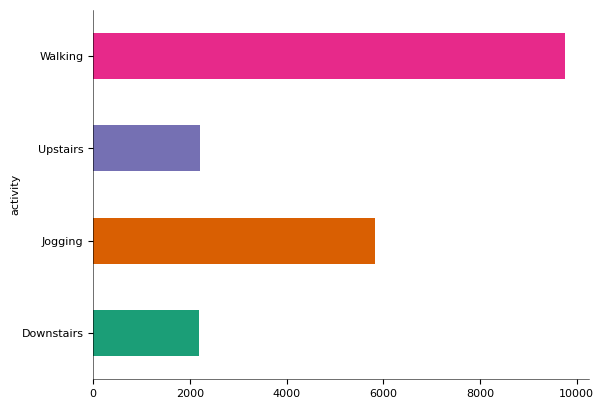
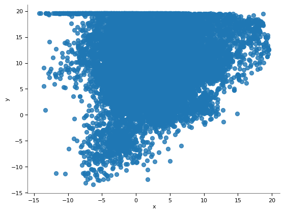
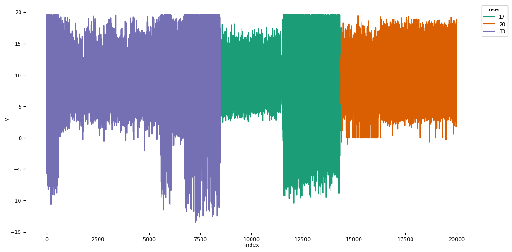
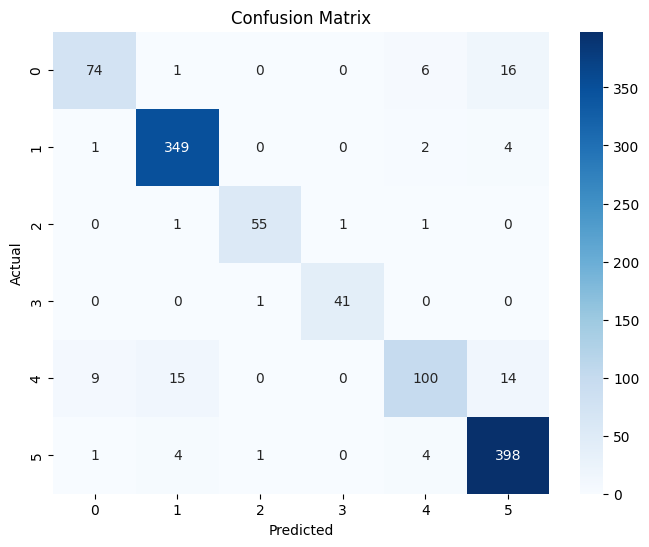

# 📱 Human Activity Recognition using WISDM Dataset + Random Forest Classifier

[](https://www.python.org/)
[](https://colab.research.google.com/drive/1IKMwNC_vxrHZZKH-Xvw_-o-AmbaJpsa1?usp=sharing)
[](#)
[](LICENSE)

---

## 📌 Project Overview

This project performs **Human Activity Recognition (HAR)** using motion sensor data from the **WISDM dataset**, applying **machine learning** techniques to classify activities like **Walking**, **Jogging**, **Sitting**, etc. The dataset contains accelerometer readings collected from smartphones during physical activities. A **Random Forest classifier** is trained to recognize patterns in the data and predict the corresponding activity.

> 📚 **Subject:** Advanced Machine Learning ( CTMTAIDS SII P1 )  
> 🏫 **Course:** M.Tech in Artificial Intelligence & Data Science (Specialization in Cybersecurity)  
> 🎓 **Institute:** National Forensic Sciences University (NFSU), Goa  
> 🔖 **Project:** AML - LPW – Activity Recognition using Sensor Data

---

## 🚀 Features

- 📂 Load and clean raw WISDM accelerometer data  
- 🧩 Extract statistical features from sliding windows (mean, std, min, max, etc.)  
- 🔢 Encode activity labels and split dataset for training/testing  
- 🌳 Train and evaluate a **Random Forest** classifier  
- 📈 Show accuracy, classification report, and visualize results using a **confusion matrix heatmap**

---

## 🛠️ Tools & Technologies

- **Python 3.10+**
- **Google Colab / Jupyter Notebook**
- **Pandas, NumPy** – Data processing
- **Matplotlib, Seaborn** – Visualization
- **Scikit-learn** – Model training and evaluation
- **WISDM Dataset v1.1**

---

## 📁 Repository Files


| File                                                                     | Description                                      |
|--------------------------------------------------------------------------|--------------------------------------------------|
| [`AML_SEE_LPW.ipynb`](AML_SEE_LPW.ipynb)                                 | Colab notebook with full code implementation     |
| [`AML_SEE_LPW.py`](AML_SEE_LPW.py)                                       | Python script with full code implementation      |
| [`AML_SEE_LPW_Output.pdf`](AML_SEE_LPW_Output.pdf)                       | Code and output results in PDF format            |
| [`2-D_Distribution_1.png`](2-D_Distribution_1.png)                       | 2D distribution plot showing feature clusters    |
| [`2-D_Distribution_2.png`](2-D_Distribution_2.png)                       | Another 2D distribution plot for comparison      |
| [`2-D_Distribution_3.png`](2-D_Distribution_3.png)                       | Third 2D distribution plot                       |
| [`2-D_Categorical_Distributions.png`](2-D_Categorical_Distributions.png) | Categorical 2D feature distribution              |
| [`Categorical_Distribution_1.png`](Categorical_Distribution_1.png)       | Activity-wise categorical distribution graph     |
| [`Categorical_Distribution_2.png`](Categorical_Distribution_2.png)       | Additional categorical distribution              |
| [`Confusion_Matrix.png`](Confusion_Matrix.png)                           | Confusion matrix for model evaluation            |
| [`Distributions_1.png`](Distributions_1.png)                             | Prediction distribution plot 1                   |
| [`Distributions_2.png`](Distributions_2.png)                             | Prediction distribution plot 2                   |
| [`Distributions_3.png`](Distributions_3.png)                             | Prediction distribution plot 3                   |
| [`Distribution_4.png`](Distribution_4.png)                               | Additional feature distribution                  |
| [`Time_Series_1.png`](Time_Series_1.png)                                 | Time series activity plot 1                      |
| [`Time_Series_2.png`](Time_Series_2.png)                                 | Time series activity plot 2                      |
| [`Time_Series_3.png`](Time_Series_3.png)                                 | Time series activity plot 3                      |
| [`Time_Series_4.png`](Time_Series_4.png)                                 | Time series activity plot 4                      |
| [`Values_1.png`](Values_1.png)                                           | Value comparison plot 1                          |
| [`Values_2.png`](Values_2.png)                                           | Value comparison plot 2                          |
| [`Values_3.png`](Values_3.png)                                           | Value comparison plot 3                          |
| [`Values_4.png`](Values_4.png)                                           | Value comparison plot 4                          |
| [`WISDM_ar_latest.tar.gz`](WISDM_ar_latest.tar.gz)                       | Raw dataset archive used for activity recognition|

---

## ▶️ Run on Google Colab

Click the badge below to run this notebook interactively in Colab:

[](https://colab.research.google.com/drive/1IKMwNC_vxrHZZKH-Xvw_-o-AmbaJpsa1?usp=sharing)

---

## 📊 Activities Recognized

- Walking  
- Jogging  
- Upstairs  
- Downstairs  
- Sitting  
- Standing

---

## 📈 Results

### 📑 Dataset Preview

```text
    user  activity      timestamp           x          y         z
0     33   Jogging   49105962326000   -0.694638   12.680544   0.503953
1     33   Jogging   49106062271000    5.012288   11.264028   0.953424
2     33   Jogging   49106112167000    4.903325   10.882658  -0.081722
...   ...     ...               ...         ...         ...        ...
1098203 rows × 6 columns
```

- Total raw samples: **1,098,203**
- Processed dataset:
  - `X` shape: **(5491, 21)**
  - `Y` shape: **(5491, )**

---

### ✅ Accuracy & Metrics

**Accuracy:** `0.9254` (≈ 92.5%)

**Classification Report:**

```text
               precision    recall  f1-score   support

  Downstairs       0.87      0.76      0.81        97
     Jogging       0.94      0.98      0.96       356
     Sitting       0.96      0.95      0.96        58
    Standing       0.98      0.98      0.98        42
    Upstairs       0.88      0.72      0.80       138
     Walking       0.92      0.98      0.95       408

    accuracy                           0.93      1099
   macro avg       0.93      0.89      0.91      1099
weighted avg       0.92      0.93      0.92      1099
```

---

### 📊 Visual Outputs

#### 📈 Feature Distributions
  
  
  


#### 🧮 Categorical Distributions
  


#### 🌐 2D Feature Distributions
  
  
  


#### ⏱️ Time Series Graphs
  
  
  


#### 📊 Value Plots
  
  
  


#### 📉 Confusion Matrix


---

## 📜 License

This project is licensed under the **GNU GPL v3**. See the [`LICENSE`](LICENSE) file for details.

---

## 🙌 Acknowledgements

- [WISDM Dataset](https://www.cis.fordham.edu/wisdm/dataset.php) – Source of motion sensor data  
- [Scikit-learn](https://scikit-learn.org) – Machine Learning Library  
- [Matplotlib](https://matplotlib.org/) & [Seaborn](https://seaborn.pydata.org/) – Visualizations  
- [Google Colab](https://colab.research.google.com) – Cloud-based Python runtime environment
